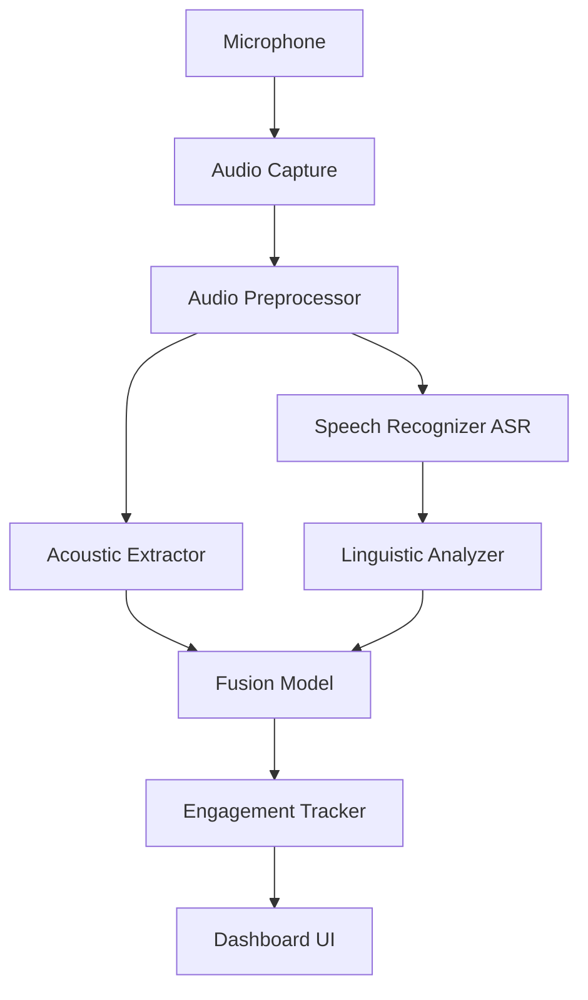
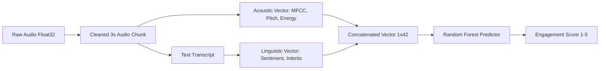
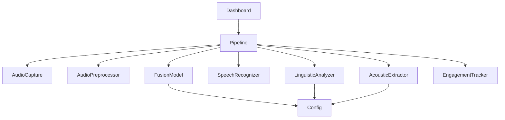
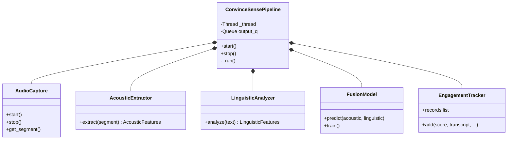

# Everything I Need To Know About This Project: Talklytics Technical Audit

## Part 1: High-Level Project Analysis

### Project Overview
- **What problem this project solves**: The project provides real-time analysis of live sales conversations to detect customer interest, engagement, and intent. It solves the problem of delayed post-call analysis by offering actionable feedback to sales reps while the conversation is still happening.
- **Target users**: Sales representatives, account executives, and sales managers who need live conversational intelligence.
- **End-to-end workflow**: The system captures audio from the microphone in 3-second chunks, preprocesses it, extracts acoustic features, transcribes the speech to text, extracts linguistic features (sentiment, intents, buying signals), fuses these features, and predicts an engagement score (1-5). The result is visualized in a real-time Streamlit dashboard along with recommended actions.
- **Input and output**: 
  - **Input**: Live continuous microphone audio stream.
  - **Output**: Real-time engagement score (1-5), detected intents (Pricing, Comparison, etc.), sentiment, buying/hesitation signals, actionable recommendations, and a visual dashboard.
- **Core ML pipeline**: Audio Capture -> Preprocessing -> Parallel (Acoustic Feature Extraction + Whisper ASR -> Linguistic NLP Analysis) -> Feature-Level Concatenation -> Random Forest Classifier Fusion -> Engagement Score.
- **Real-world use case**: A sales rep is on a Zoom call with a prospect. Talklytics runs in the background. When the prospect asks "how much does it cost?", the system detects a "PRICING" intent and "Interested" score, prompting the rep with "💰 Discuss pricing breakdown clearly — be transparent."
- **Business value**: Increases conversion rates by guiding sales reps in real-time, reduces the need for extensive post-call coaching, and provides quantifiable metrics on prospect engagement throughout the call.

### System Architecture Overview

#### Architecture Diagram


#### Data Flow Diagram


#### Component Dependency Diagram


---

## Part 2: Repository Walkthrough

### Directory Structure & File Analysis

```text
.
├── dashboard/
│   ├── app.py (Streamlit dashboard UI)
│   └── sphere.py (Reactive HTML/CSS visualization component)
├── modules/
│   ├── acoustic_extractor.py (MFCC, Pitch, Energy via librosa)
│   ├── audio_capture.py (Microphone stream via sounddevice)
│   ├── audio_preprocessor.py (Silence gating, normalization)
│   ├── engagement_tracker.py (In-memory time-series state)
│   ├── fusion_model.py (Random Forest prediction logic)
│   ├── linguistic_analyzer.py (DistilBERT NLP and rule-based intents)
│   ├── pipeline.py (Background thread orchestrator)
│   └── speech_recognizer.py (Faster-Whisper ASR)
├── training/
│   ├── generate_synthetic_data.py (Data generation for testing)
│   └── train_model_standalone.py (Trains Random Forest on synthetic data)
├── models/
│   └── fusion_model.pkl & label_encoder.pkl (Serialized ML models)
├── tests/
│   └── test_convincesense.py (Pytest unit tests)
├── main.py (Headless CLI entry point)
└── config.py (Central configurations, thresholds, and prompts)
```

### Detailed File Breakdown

**`config.py`**
- **Why it exists**: Centralizes all hyper-parameters, thresholds, and keyword logic.
- **What it does**: Holds audio settings (Sample rate, segments), feature configs, NLP thresholds, Intent Rules.
- **Called By**: Almost every module.
- **Possible Improvements**: Move secrets/environment-specific paths to a `.env` file.

**`main.py`**
- **Why it exists**: Headless execution without UI.
- **What it does**: Instantiates `ConvinceSensePipeline`, polls `output_q`, and prints to stdout.
- **Called By**: User (CLI).
- **Calls**: `ConvinceSensePipeline`.

**`modules/pipeline.py`**
- **Why it exists**: Decouples the processing loop from the UI thread.
- **What it does**: Runs a background daemon thread that sequences Capture -> Preprocess -> Acoustic/ASR -> NLP -> Fusion -> Tracking. Pushes results to a Thread-Safe Queue.
- **Key Functions**: `_run()`, `start()`, `stop()`.

**`modules/fusion_model.py`**
- **Why it exists**: Makes the final prediction.
- **What it does**: Loads scikit-learn Random Forest. Concatenates 36-dim acoustic and 6-dim linguistic features. Predicts 1-5 score. Contains fallback heuristics.
- **Key Functions**: `predict()`, `train()`, `_heuristic()`.
- **Possible Improvements**: Decouple training code into `ml/` folder. Use deep learning cross-attention instead of flat concatenation.

**`modules/linguistic_analyzer.py`**
- **Why it exists**: NLP intelligence layer.
- **What it does**: HuggingFace DistilBERT for sentiment. Rule-based Regex/Keyword matching for intents and buying signals.
- **Key Functions**: `analyze()`, `_detect_intents()`.
- **Possible Improvements**: Swap DistilBERT for an LLM endpoint or zero-shot classifier for robust intent detection.

**`dashboard/app.py`**
- **Why it exists**: Frontend UI.
- **What it does**: Streamlit loop that polls pipeline output queue, renders metrics, updates timeline matplotlib chart, and displays the reactive sphere.
- **Key Functions**: Streamlit procedural flow, `st.rerun()` polling.
- **Possible Improvements**: Transition to a proper frontend (React/Next.js) with WebSockets to avoid `st.rerun()` polling.

---

## Part 3: Execution Flow

### Execution Trace (`python main.py` or `streamlit run dashboard/app.py`)

1. **Application Startup**: `main.py` creates `ConvinceSensePipeline`.
2. **Config Loading**: All modules import defaults from `config.py`.
3. **Pipeline Start**: `pipeline.start()` launches a background daemon thread (`_run()`) and opens the `sounddevice` input stream.
4. **Audio Capture**: `AudioCapture._callback` accumulates PCM samples into 3-second blocks and pushes to an internal queue.
5. **Preprocessing**: `pipeline` pops a block. `AudioPreprocessor` normalizes amplitude and drops blocks if below silence threshold.
6. **Feature Extraction (Parallel Logic)**:
    - **Acoustic**: `AcousticExtractor` uses `librosa` to get MFCCs, pitch, and energy.
    - **Speech Recognition**: `SpeechRecognizer` runs `faster-whisper` on CPU to get transcript.
7. **Linguistic Analysis**: Transcript is sent to `LinguisticAnalyzer` for sentiment analysis and intent keyword matching.
8. **Fusion Layer**: Both feature vectors are passed to `FusionModel.predict()`. They are concatenated and run through the Random Forest.
9. **Tracking**: Prediction, confidence, and metadata are saved to `EngagementTracker` which creates an `EngagementRecord`.
10. **Visualization/Output**: Record is put into `pipeline.output_q`. The dashboard UI drains this queue and updates widgets/charts.

---

## Part 4: Class Architecture

### UML Class Overview



**Design Patterns Used**:
- **Facade Pattern**: `ConvinceSensePipeline` acts as a facade hiding the complexity of the underlying subsystem.
- **Producer-Consumer**: `AudioCapture` produces audio to a queue, `Pipeline` consumes. `Pipeline` produces `EngagementRecords` to a queue, `app.py` consumes.
- **Singleton (Dashboard)**: `@st.cache_resource` ensures only one Pipeline exists across Streamlit reruns.

---

## Part 5: Machine Learning Analysis

### Dataset & Training
- **Dataset Source**: Completely synthetic data generated by `training/train_model_standalone.py`.
- **Features**: 42-dimensional vector (36 Acoustic + 6 Linguistic).
- **Labels**: Integers 1 to 5 representing engagement.
- **Feature Engineering**:
  - **Acoustic (36 dims)**: MFCC mean(13), MFCC std(13), Pitch mean(1), Pitch std(1), Energy(1), Spectral Contrast mean(7).
  - **Linguistic (6 dims)**: Sentiment Encoded(-1, 0, 1), Sentiment Score, Buying Count, Hesitation Count, Intent Count, Intent Confidence.

### Fusion Strategy
- **Implemented**: **Early Fusion (Feature-Level Fusion)**.
- **Mechanism**: The 36 acoustic features and 6 linguistic features are flat-concatenated into a 42-D array before being passed to a single classifier.
- **Tradeoffs**: Simple to implement and allows Random Forest to build trees across modalities. However, lacks the ability to learn complex temporal or semantic cross-modal alignments (like sarcasm).

### Model Analysis
- **Algorithm**: `RandomForestClassifier` from scikit-learn.
- **Hyperparameters**: `n_estimators=200`, `class_weight="balanced"`.
- **Training Strategy**: 80/20 train-test split on 2000 synthetic samples.
- **Evaluation metrics**: Accuracy, Classification Report (Precision/Recall/F1), Confusion Matrix.

---

## Part 6: Data Pipeline

1. **Raw Audio**: Captured via microphone, Float32, 16kHz, mono.
2. **Preprocessing**: Normalization and silence removal via RMS threshold.
3. **Speech-to-Text**: Raw audio passed to Faster-Whisper. Output: String text.
4. **Feature Extraction**: 
    - Text -> `distilbert-base-uncased-finetuned-sst-2-english` -> Sentiment.
    - Audio -> librosa -> MFCC/Pitch/Energy.
5. **Feature Fusion**: Flattened into `np.ndarray` of shape `(42,)`.
6. **Model Prediction**: Random forest predicts class label.
7. **Feedback Generation**: Rule-based matching on `config.INTENT_RECOMMENDATIONS` outputs UI actionable text.

**Stored Artifacts**:
- `fusion_model.pkl`: Model weights.
- `label_encoder.pkl`: Class mappings.

---

## Part 7: Dashboard Analysis

### Framework: Streamlit
- **Interaction Flow**: User clicks "Start". Streamlit flags session state and triggers pipeline. Streamlit sleeps for 1s and calls `st.rerun()`. On every run, it drains the queue and repaints the screen.
- **Visualizations**: 
  - Matplotlib line chart for engagement timeline.
  - HTML/CSS injected via `components.html` for the audio-reactive animated sphere.
- **State Management**: Uses `st.session_state` to persist historical records and running status across reruns.
- **Performance Bottlenecks**: 
  - Matplotlib is slow and blocking. Rerendering `plt.subplots` every second is computationally wasteful.
  - `st.rerun()` polling is an anti-pattern for real-time streaming, leading to UI jitters.

---

## Part 8: Code Quality Audit

| Location | Problem | Impact | Recommended Fix | Priority |
|---|---|---|---|---|
| `modules/` | Utility Folder Anti-Pattern | Difficult to scale, conflates ML, audio, and UI logic. | Move to feature-based architecture (`src/features/...`) | High |
| `dashboard/app.py` | Blocking Matplotlib | Causes UI lag during `st.rerun()` loops. | Use Altair, Plotly, or Streamlit native line charts. | High |
| `modules/fusion_model.py` | Synthetic Training tight coupling | Hard to swap to real datasets without rewriting feature pipelines. | Separate inference code from training code entirely. | Medium |
| `modules/pipeline.py` | Generic Exception Catching | Hides critical audio hardware failures. | Catch specific exceptions, use proper logging module. | Medium |
| `config.py` | Hardcoded values | Changing thresholds requires touching source code. | Implement `.env` and `pydantic` settings management. | Medium |

---

## Part 9: Architecture Review

- **SOLID**: Follows Single Responsibility quite well (each extractor does one thing). Lacks Dependency Inversion (pipeline hard-codes instantiations).
- **Separation of Concerns**: Good separation between UI, Audio, NLP, and ML.
- **Testability**: High. Dependencies are pure functions/classes, easy to mock (as seen in `test_convincesense.py`).

**Scores:**
- Architecture Score: 6/10
- Code Quality Score: 8/10
- ML Pipeline Score: 5/10 (Too reliant on synthetic data, naive early fusion)
- Maintainability Score: 7/10
- Production Readiness Score: 3/10 (Cannot be deployed to web/cloud as-is due to local mic capture and Streamlit threading).

---

## Part 10: Refactoring Plan

### Proposed Architecture

```text
src/
├── core/
│   ├── config.py
│   ├── logger.py
│   └── constants.py
├── features/
│   ├── acoustic/ (extractor.py, preprocessor.py)
│   ├── linguistic/ (analyzer.py, recognizer.py)
│   └── engagement/ (tracker.py)
├── ml/
│   ├── inference/ (fusion_inference.py)
│   ├── training/ (train_pipeline.py, data_loader.py)
│   └── models/ (.pkl artifacts)
├── pipelines/
│   ├── live_pipeline.py
│   └── batch_pipeline.py
├── api/ (FastAPI endpoints)
├── dashboard/ (React or improved Streamlit)
└── tests/
```

### Migration Steps
1. **Current Location -> New Location**:
   - `modules/fusion_model.py` -> Split into `src/ml/inference/` and `src/ml/training/`.
   - `modules/audio_capture.py` -> `src/core/hardware/`.
2. **What should be deleted**:
   - Generic `modules/` structure.
   - Matplotlib inline rendering in dashboard.
3. **What should be added**:
   - Structured logging (`logging.getLogger()`).
   - `pydantic` for config.
   - MLflow for experiment tracking in the ML folder.

---

## Part 11: Production Readiness

### Version 1: Local ML Project (Current State -> Cleaned)
Refactor into `src/` layout. Add `pydantic` for env vars. Add proper logging. 

### Version 2: Web Application
- **Backend**: FastAPI. Convert `ConvinceSensePipeline` into an async WebSocket endpoint. It receives binary audio chunks from the frontend.
- **Frontend**: React.js / Next.js. Uses Web Audio API to capture microphone data and stream via WebSockets.
- **State**: Redis to store real-time engagement data for dashboard retrieval.

### Version 3: Cloud Deployment (AWS/GCP)
- Containerize the FastAPI backend via **Docker**.
- Offload ASR to Whisper API (or run a GPU microservice) to reduce CPU latency.
- Offload Sentiment to an internal TRT-LLM or vLLM container.
- Deploy to Kubernetes (EKS/GKE) or AWS ECS.
- CI/CD via GitHub Actions to run Pytest and build Docker images.

---

## Part 12: Knowledge Transfer Document Summary
*(See the comprehensive walkthrough above. This document serves as the complete technical transfer guide.)*

**Immediate Action Items for next developer:**
1. Do not use Streamlit for production streaming. Move to WebSockets.
2. Replace synthetic training script with real dataset (MELD/RAVDESS).
3. Refactor the `modules/` anti-pattern into the `src/` modular design.
