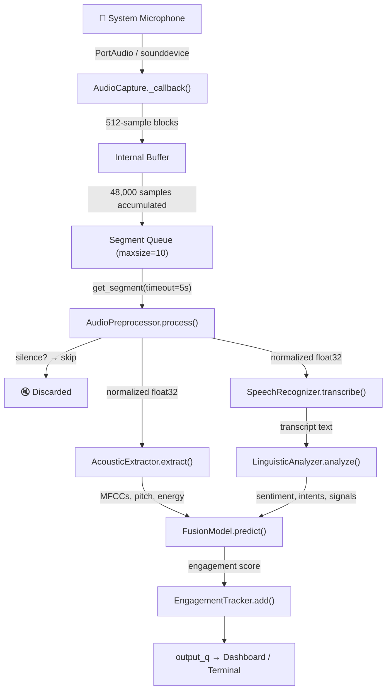

# 🎙️ Audio Capture Pipeline — Complete Analysis

## 1. Executive Summary

ConvinceSense uses **the laptop's built-in microphone** (or any system default input device) — **no external microphone is required**. The pipeline uses the [`sounddevice`](file:///Users/amanmeena/Documents/Work/ConvinceSense-Update/src/core/audio_capture.py) library (a Python binding for PortAudio) to open a low-level audio input stream, captures 3-second segments of mono 16 kHz audio, preprocesses each segment (silence filter + amplitude normalization), then feeds it to Faster-Whisper for transcription and downstream NLP/ML analysis.

---

## 2. Complete Execution Flow



---

## 3. Microphone & Device Selection

### 3.1 Device Selection Logic

The device selection is handled by [`_find_input_device()`](file:///Users/amanmeena/Documents/Work/ConvinceSense-Update/src/core/audio_capture.py#L18-L49) with a three-tier fallback:

| Priority | Strategy | Code |
|----------|----------|------|
| **1st** | System default input device (`sd.default.device[0]`) — verified to have ≥1 input channel | Lines 28–33 |
| **2nd** | First device with "microphone" in its name (case-insensitive scan) | Lines 41–47 |
| **3rd** | First device with ≥1 input channel | Lines 44–45 |
| **Last** | `None` — lets sounddevice/PortAudio pick (may fail) | Line 49 |

### 3.2 Key Takeaway: Built-in vs. External Microphone

> [!IMPORTANT]
> The code **automatically uses the OS-level default input device**. On macOS, this is typically the **MacBook's built-in microphone** unless the user has changed the default in System Settings → Sound → Input. If an external USB/Bluetooth microphone is connected and set as default, it will be used instead. **No external microphone is required.**

The `AudioCapture.__init__()` constructor also accepts an optional `device` parameter ([line 68](file:///Users/amanmeena/Documents/Work/ConvinceSense-Update/src/core/audio_capture.py#L68)), allowing callers to override the auto-detection. However, neither [`ConvinceSensePipeline`](file:///Users/amanmeena/Documents/Work/ConvinceSense-Update/src/pipelines/live_pipeline.py#L34) nor the dashboard ever pass this argument — so auto-detection always runs.

---

## 4. Audio Configuration Parameters

All audio constants are centralized in [config.py](file:///Users/amanmeena/Documents/Work/ConvinceSense-Update/src/core/config.py#L9-L13):

| Parameter | Value | Where Used | Notes |
|-----------|-------|------------|-------|
| `SAMPLE_RATE` | **16,000 Hz** | AudioCapture, AcousticExtractor, SpeechRecognizer | Standard for speech; Whisper expects 16 kHz |
| `CHANNELS` | **1** (mono) | AudioCapture | Single channel — appropriate for a single mic |
| `SEGMENT_DURATION` | **3 seconds** | AudioCapture | Each analysis window = 3s of audio |
| `SILENCE_THRESHOLD` | **0.001** (RMS) | AudioPreprocessor | Very low — tuned to "catch quieter voices" |
| `_blocksize` | **512 samples** | AudioCapture (hardcoded) | ~32 ms per callback at 16 kHz |
| Segment samples | **48,000** | Computed: `16000 × 3` | Samples per segment |
| Queue `maxsize` | **10** | AudioCapture | Max 10 buffered segments (30s of audio) |

---

## 5. Stage-by-Stage Detailed Trace

### Stage 1: Stream Initialization — [`AudioCapture.start()`](file:///Users/amanmeena/Documents/Work/ConvinceSense-Update/src/core/audio_capture.py#L90-L106)

```python
sd.InputStream(
    samplerate=16000,
    channels=1,
    dtype="float32",
    blocksize=512,
    callback=self._callback,
    device=<auto-detected index or None>,
)
```

- Opens a **non-blocking** PortAudio input stream.
- The `callback` function is invoked by a **real-time audio thread** managed by PortAudio — not by Python.
- `dtype="float32"` means samples arrive as `[-1.0, 1.0]` normalized floats.

### Stage 2: Callback Buffering — [`AudioCapture._callback()`](file:///Users/amanmeena/Documents/Work/ConvinceSense-Update/src/core/audio_capture.py#L140-L171)

Every ~32 ms, PortAudio calls `_callback` with a 512-sample block:

1. **Overflow check**: If `status.input_overflow` is true, emits a Python `warnings.warn()` — does **not** raise or halt.
2. **Thread-safe accumulation**: Acquires `self._lock`, appends `indata.copy().flatten()` to `self._buffer`.
3. **Segment assembly**: When accumulated samples ≥ 48,000:
   - Concatenates the buffer into a single array.
   - Slices off exactly 48,000 samples as the segment.
   - Any remainder is kept for the next segment (no data loss at boundaries).
   - Puts the segment into `self._q` via `put_nowait()`.
4. **Queue-full behavior**: If the queue (maxsize=10) is full, **silently drops** the segment (`except queue.Full: pass`).

### Stage 3: Preprocessing — [`AudioPreprocessor.process()`](file:///Users/amanmeena/Documents/Work/ConvinceSense-Update/src/features/acoustic/preprocessor.py#L17-L37)

1. **Cast to float32** (already float32 from sounddevice, but ensures consistency).
2. **Silence filter**: Compute RMS; if RMS < 0.001, return `None` → segment skipped.
3. **Peak normalization**: Divide by `max(abs(segment))` to normalize to `[-1.0, 1.0]`.

> [!NOTE]
> There is **no noise reduction, bandpass filtering, or echo cancellation**. The only preprocessing is silence gating and amplitude normalization.

### Stage 4: Acoustic Feature Extraction — [`AcousticExtractor.extract()`](file:///Users/amanmeena/Documents/Work/ConvinceSense-Update/src/features/acoustic/extractor.py#L42-L71)

Uses **librosa** to extract from the 3-second segment:
- 13 MFCCs (mean + std → 26 values)
- Pitch via `librosa.pyin` (mean + std → 2 values)
- RMS energy (1 value)
- Spectral contrast (7 bands, mean → 7 values)
- **Total feature vector: 36 dimensions**

### Stage 5: ASR Transcription — [`SpeechRecognizer.transcribe()`](file:///Users/amanmeena/Documents/Work/ConvinceSense-Update/src/features/linguistic/recognizer.py#L25-L37)

Uses **Faster-Whisper** (`faster_whisper.WhisperModel`):

| Setting | Value | Rationale |
|---------|-------|-----------|
| Model size | `"small"` | Balance between accuracy and CPU speed |
| Device | `"cpu"` | No GPU required |
| Compute type | `"int8"` | Quantized for faster CPU inference |
| Beam size | `1` | Greedy decoding — fastest mode |
| VAD filter | `True` | Skips silence within the segment |
| Language | `"en"` | Hardcoded English |

The float32 NumPy array is passed directly to `model.transcribe()` — Faster-Whisper accepts raw arrays at the expected 16 kHz sample rate.

### Stage 6: Linguistic Analysis — [`LinguisticAnalyzer.analyze()`](file:///Users/amanmeena/Documents/Work/ConvinceSense-Update/src/features/linguistic/analyzer.py#L58-L86)

- **Sentiment**: DistilBERT (`distilbert-base-uncased-finetuned-sst-2-english`) → POSITIVE / NEGATIVE / NEUTRAL
- **Keyword matching**: Buying signals (14 keywords) + hesitations (9 keywords) via substring match
- **Intent detection**: Rule-based pattern matching across 5 intent categories with density-based confidence scoring

### Stage 7: Fusion & Output

- [`FusionModel.predict()`](file:///Users/amanmeena/Documents/Work/ConvinceSense-Update/src/ml/inference/fusion_inference.py) combines acoustic + linguistic feature vectors → engagement score (1–5)
- [`EngagementTracker.add()`](file:///Users/amanmeena/Documents/Work/ConvinceSense-Update/src/features/engagement/tracker.py#L41-L76) records the result with timestamp, applies EMA smoothing to intent confidence
- Result is pushed to `output_q` for consumption by the Streamlit dashboard or terminal

---

## 6. Identified Issues & Potential Problems

### 🔴 Issue 1: Lock Contention in Real-Time Audio Callback

**Location**: [`_callback()`](file:///Users/amanmeena/Documents/Work/ConvinceSense-Update/src/core/audio_capture.py#L159-L171) acquires `threading.Lock` on every 32 ms callback.

**Root Cause**: PortAudio's callback runs on a **real-time audio thread**. Python's `threading.Lock` can block if the GIL or consumer thread holds it. If the lock is contended, the callback may not return in time, causing **input overflow** (dropped audio frames).

**Impact**: Intermittent `input_overflow` warnings; lost audio data before it reaches the buffer.

**Recommendation**: Replace the lock-protected list with a **lock-free** data structure — e.g., use a `queue.Queue` for raw blocks (the callback only does `put_nowait`) and accumulate in the consumer thread instead.

---

### 🟡 Issue 2: Silent Segment Drop on Full Queue

**Location**: [Line 170–171](file:///Users/amanmeena/Documents/Work/ConvinceSense-Update/src/core/audio_capture.py#L168-L171) — `except queue.Full: pass`.

**Root Cause**: If downstream processing (Whisper inference, NLP) takes longer than 3s per segment, the 10-slot queue fills up. New segments are silently discarded with no logging.

**Impact**: Lost speech data during sustained conversation if Whisper falls behind — especially likely on a slower CPU with the `"small"` model.

**Recommendation**: Log when segments are dropped. Consider increasing queue size or switching to `"tiny"` / `"base"` model for slower hardware.

---

### 🟡 Issue 3: No Audio Noise Reduction

**Location**: [AudioPreprocessor](file:///Users/amanmeena/Documents/Work/ConvinceSense-Update/src/features/acoustic/preprocessor.py) only performs silence gating and peak normalization.

**Root Cause**: Built-in laptop microphones capture significant ambient noise (fan, keyboard, room echo). Without any spectral noise reduction, bandpass filtering, or echo cancellation, the raw noisy signal is passed directly to Whisper and librosa.

**Impact**: 
- Whisper may hallucinate text from background noise
- Acoustic features (especially pitch and MFCCs) are contaminated
- The very low `SILENCE_THRESHOLD = 0.001` means nearly any ambient noise passes through

**Recommendation**: Add a simple bandpass filter (300–3400 Hz for speech) and/or spectral noise gating (e.g., `noisereduce` library).

---

### 🟡 Issue 4: 3-Second Segment Boundary Cuts Mid-Word

**Location**: [`SEGMENT_DURATION = 3`](file:///Users/amanmeena/Documents/Work/ConvinceSense-Update/src/core/config.py#L12) with hard sample-count slicing in the callback.

**Root Cause**: Segments are sliced at exactly 48,000 samples regardless of speech content. Words spoken across a segment boundary are split — the beginning is in one segment, the end in the next.

**Impact**: Whisper may fail to recognize partial words at segment boundaries, and linguistic features lose context.

**Recommendation**: Use overlapping segments (e.g., 50% overlap) or implement a Voice Activity Detection (VAD) based segmentation to cut on silence boundaries.

---

### 🟢 Issue 5: Sequential Processing Creates Latency

**Location**: [`_run()` loop](file:///Users/amanmeena/Documents/Work/ConvinceSense-Update/src/pipelines/live_pipeline.py#L79-L137) processes stages 2–7 sequentially on a single thread.

**Root Cause**: ASR (Whisper `"small"` with `int8`) on CPU can take 1–4 seconds per 3-second segment. Acoustic extraction and NLP add further time. If total processing > 3s, segments accumulate in the queue faster than they're consumed.

**Impact**: Increasing latency over time; eventually queue fills and segments are dropped (Issue 2).

**Recommendation**: Run ASR and acoustic extraction in parallel (they're independent), or pipeline them across threads. Consider `"base"` model if running on constrained hardware.

---

### 🟢 Issue 6: No Device-Change Handling

**Root Cause**: If a user plugs in/disconnects a USB microphone mid-session, the PortAudio stream continues using the original device (or crashes). There is no device-change detection or stream reconnection logic.

**Recommendation**: Wrap the stream in a reconnection loop or listen for device-change events.

---

## 7. Data Flow Summary Table

| Stage | Component | Input | Output | Library |
|-------|-----------|-------|--------|---------|
| 0 | OS Audio Subsystem | Physical microphone | PCM audio | macOS CoreAudio |
| 1 | `AudioCapture.start()` | Device index | `sd.InputStream` | `sounddevice` (PortAudio) |
| 2 | `_callback()` | 512-sample float32 blocks | 48,000-sample segments | `numpy` |
| 3 | `AudioPreprocessor.process()` | Raw segment | Normalized segment or `None` | `numpy` |
| 4 | `AcousticExtractor.extract()` | Clean segment | 36-dim feature vector | `librosa` |
| 5 | `SpeechRecognizer.transcribe()` | Clean segment | Text string | `faster-whisper` (CTranslate2) |
| 6 | `LinguisticAnalyzer.analyze()` | Text string | Sentiment + intents + signals | `transformers` (DistilBERT) |
| 7 | `FusionModel.predict()` | Acoustic + linguistic vectors | Score (1–5) | `scikit-learn` (pickled model) |
| 8 | `EngagementTracker.add()` | All features | `EngagementRecord` | Pure Python |

---

## 8. Answer to Key Questions

| Question | Answer |
|----------|--------|
| **Built-in or external mic?** | Built-in by default; external if set as OS default |
| **Explicit device selection?** | No — auto-detects system default, falls back through scan |
| **Sample rate?** | 16,000 Hz (mono) |
| **Chunk/block size?** | 512 samples (~32 ms) per callback; assembled into 48,000-sample (3s) segments |
| **Recording duration?** | Continuous; segments are 3 seconds each |
| **Audio preprocessing?** | Silence gate (RMS < 0.001) + peak normalization only — no noise reduction |
| **Transcription engine?** | Faster-Whisper `"small"` model, CPU, int8 quantized, greedy decoding |
| **Biggest risk to accuracy?** | No noise reduction + segment boundary word splits + potential queue overflow |
